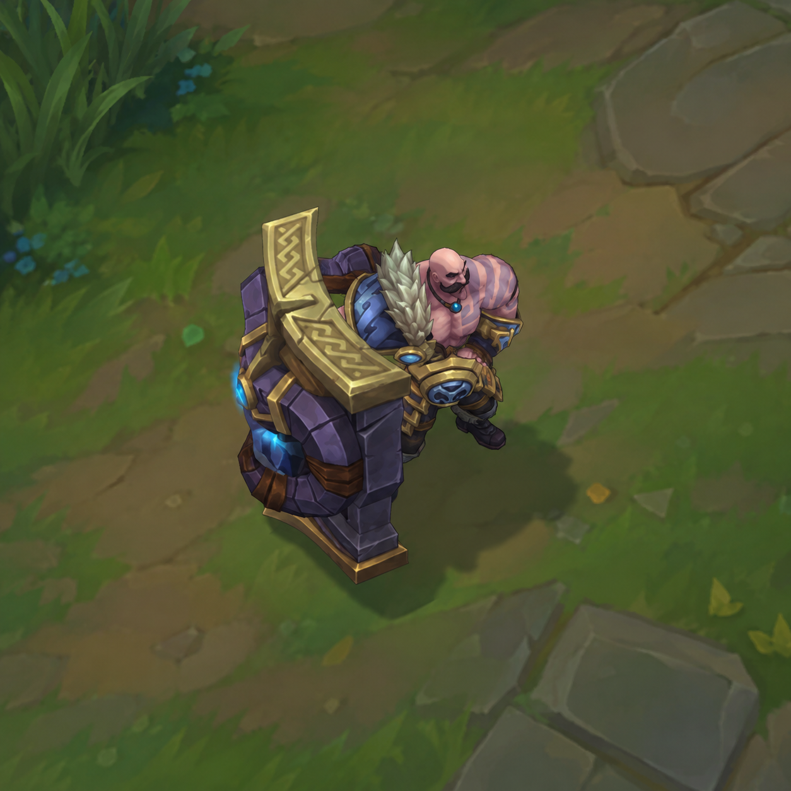
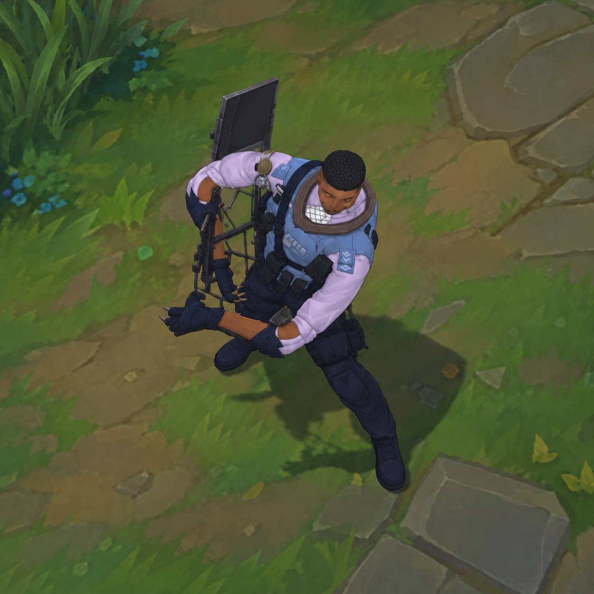

# Clash Braum

An independently developed custom **League of Legends** skin that transforms Braum into **Clash from Rainbow Six Siege**, with an adapted character and shield, custom textures, electrical effects, and integrated audio.

## Before → After

| Default Braum | Clash Braum |
| :---: | :---: |
|  |  |

**Stone shield → riot shield · Original appearance → tactical gear · Ice effects → electricity**

- **3D:** model adaptation, rigging, textures, materials
- **Integration:** animation compatibility, visual effects, audio
- **Engineering:** Python tooling, asset conversion, validation

## What I Built

I handled the conversion end-to-end, adapting existing character assets to Braum's gameplay:

- **Model and movement:** adjusted proportions, rigging and skin weights (how the model follows its skeleton), then refined deformation across Braum's animations.
- **Surface and effects:** UV mapping (placing textures on a 3D model), custom textures and materials, shield work, and electrical visual effects (VFX).
- **Audio and delivery:** integrated Clash sound effects and English voice lines, converted game assets, packaged `.fantome` mods, and iterated through debugging and in-game testing.

## Highlights

- **3,963 frames across 59 animation clips** checked for structural issues during development. [Validation record](validation/rig_refinement_validation.json)
- **26% fewer shield triangles:** 12,256 → 9,062, preserving the reviewed silhouette and grip. [Optimization record](validation/shield_checkpoint_acceptance.json)
- **Gameplay-tested conversion:** model, textures, electrical effects, sound effects and voice integration accepted together in a packaged `.fantome` build. [Project status](audit/BRAUM_CLASH_MASTER_IMPLEMENTATION_PLAN.md)

## Final Result

*Finished character appearance. The accepted skin includes electrical effects and audio; the later HUD portrait/ability-icon update is awaiting in-game confirmation.*

## Technical Pipeline

Concept → Model adaptation → Rigging & weights → UVs & textures → Materials, VFX & audio → Testing → Packaging

## Tools

- **Blender + Aventurine:** modeling, rigging, texture work, and League asset import/export.
- **Python, LeagueToolkit / wadtools, RitoBin:** asset processing, format conversion, and validation.
- **wav2wem, vgmstream, wwiser:** audio encoding, decoding, and sound-bank inspection.
- **Git / GitHub:** version control and project documentation.

## What I Learned

- Debug unfamiliar file formats by isolating failures and checking data at each conversion step.
- Learn technical-art workflows independently while balancing appearance, animation, and game constraints.
- Combine automated validation with visual review and in-game feedback; a file that decodes correctly can still fail at runtime.
- Work across 3D assets, scripting, audio, and packaging to deliver one integrated result.

## Development Details

For implementation evidence and reproduction notes, see the [working pipeline](work/README.md), [master implementation record](audit/BRAUM_CLASH_MASTER_IMPLEMENTATION_PLAN.md), and [technical appendices](audit/TECHNICAL_APPENDICES.md).

*Independent fan project using League of Legends and Rainbow Six Siege assets. My contribution is the custom adaptation and integration described above.*
